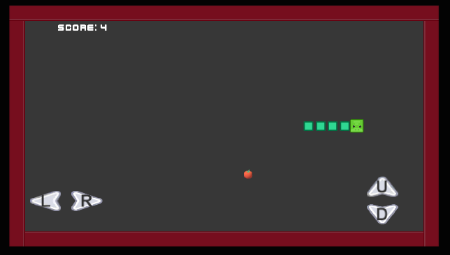

# 🐍 Snake Game - Unity




A modern take on the classic Snake game with mobile-friendly controls and adaptive scaling.

## ✨ Features
- Mobile touch controls (D-pad buttons)
- Dynamic screen adaptation
- Sound effects (eating, game over)
- Score system with high scores
- Clean UI with game states

## 📦 Project Structure
SNAKE GAME/
├── Assets/ # Game assets
│ ├── Audio/ # Sound files
│ ├── Prefabs/ # Game objects
│ ├── Scenes/ # Game scenes
│ └── Scripts/ # C# scripts
├── ProjectSettings/ # Unity configuration
├── Packages/ # Dependencies
├── Main Menu.png # Main menu screenshot
├── GameplayScreen.png # Gameplay screenshot
└── Video.mp4 # Gameplay video
....

## 🚀 Getting Started

### Option 1: Play the APK
1. Download the latest APK from [Releases](#)
2. Enable "Install unknown sources" in Android settings
3. Install and enjoy!

### Option 2: Build from Source
1. Clone the repository:
   ```bash
   git clone https://github.com/DevHasnainzx/snake-game.git

   Open in Unity (version 6000.90.45f recommended)
    Build for your target platform

🎥 Gameplay Video
https://Video.mp4

📜 Credits
Sound effects: [freesound.org]

Art assets: Kenney.nl

Font: [Google Fonts]

Developed by Muhammad Hasnain Khan
